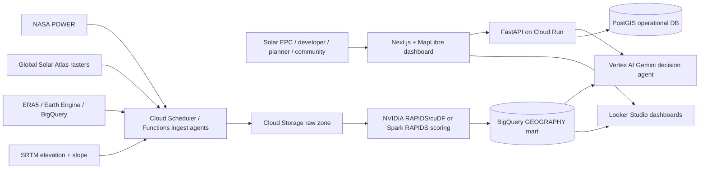

# Sola Hackathon Modernization Plan

## Target architecture

## Users and bottleneck

Sola serves solar EPCs, renewable developers, planners, community energy groups, and renewable data-center siting teams. Their bottleneck is the high-cost, data-dependent decision of which parcels or rooftops deserve engineering diligence first. The platform ranks viability, yield, flood risk, grid proximity, and data confidence before field visits.

## Pipeline

1. **Ingest:** NASA POWER hourly/daily irradiance and meteorology, Global Solar Atlas GHI/DNI/PVOUT rasters, ERA5 climate history, SRTM elevation/slope, flood layers, grid/substation layers, and user parcels.
2. **Clean:** Normalize CRS to EPSG:4326, validate polygons, deduplicate sites, mask raster nodata, cache source API responses, and track source timestamps.
3. **Analyze:** Enrich sites with GHI/DNI/DHI, temperature, slope, flood risk, grid distance, capacity, annual generation, and confidence.
4. **Accelerate/model:** Use RAPIDS cuDF for vectorized suitability scoring and Spark RAPIDS on Dataproc/GKE for national-scale raster overlays. Use PVLib plus Vertex AI/AutoML for yield forecasting.
5. **Visualize/decide:** Serve MapLibre layers, BigQuery/Looker dashboards, Gemini natural-language ranking, alerts, GeoJSON export, and project recommendation reports.

## Data sources

- NASA POWER API: global hourly/daily GHI, DNI, DHI, temperature, wind, precipitation, and humidity.
- Global Solar Atlas: GHI, DNI, GTI, PVOUT raster products for bankability-grade screening; store source download manifests in Cloud Storage.
- ERA5: reanalysis weather/climate history from Copernicus or Google-hosted public data where available.
- NSRDB: higher-resolution irradiance for covered geographies, especially U.S. and selected regions.
- SRTM: elevation, slope, and coarse horizon/shading proxy.
- Optional advanced layer: NOAA/NASA space weather alerts for operational risk narratives around inverter/grid disturbance, not core annual yield.

## Google Cloud + NVIDIA evidence

- **Cloud Storage** keeps immutable raw files and cached API responses.
- **BigQuery GEOGRAPHY** supports scalable spatial filters, rankings, and Looker Studio dashboards.
- **Vertex AI Gemini** converts natural language constraints into explainable ranking filters and recommendations.
- **Cloud Run** hosts the FastAPI decision API.
- **NVIDIA RAPIDS/cuDF** accelerates scoring and feature engineering on millions of candidate sites; benchmark scripts report rows/second for pandas CPU vs cuDF GPU.
- **Spark RAPIDS** can be added on Dataproc/GKE when raster overlays and nationwide parcel batches exceed a single GPU worker.

## Demo script

1. Show the Kerala map with irradiance/risk-ranked sites and filters.
2. Ask: “Rank sites near Kochi for a 10MW project with <5% flood risk and high yield forecast.”
3. Open the recommendation panel and explain score drivers.
4. Call the NASA POWER endpoint for a selected lat/lon and show cached GHI/DNI/DHI enrichment.
5. Show BigQuery SQL for spatial ranking and Looker dashboard concepts.
6. Run the benchmark script locally/GPU and highlight time-to-insight improvement.
7. Close with responsible AI: screening assistant only, explainable factors, source confidence, and human engineering review.

## Responsible AI

Sola presents recommendations as screening intelligence, not final build approvals. Every score should expose factor weights, source age, uncertainty, and missing-data flags. Satellite/reanalysis products can be biased by terrain, clouds, aerosols, and local microclimates, so bankability decisions still require ground measurements, grid studies, structural review, and permitting analysis.
